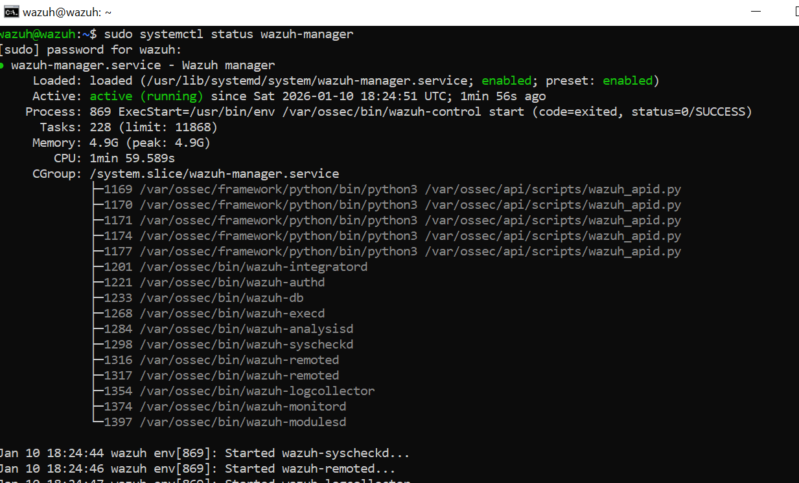
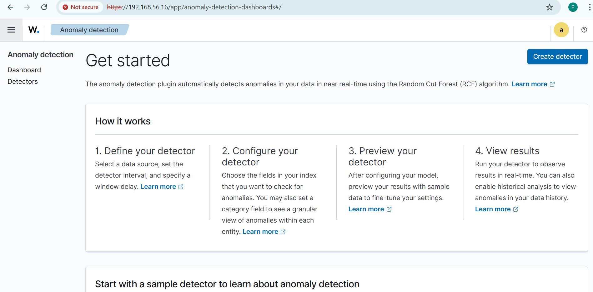
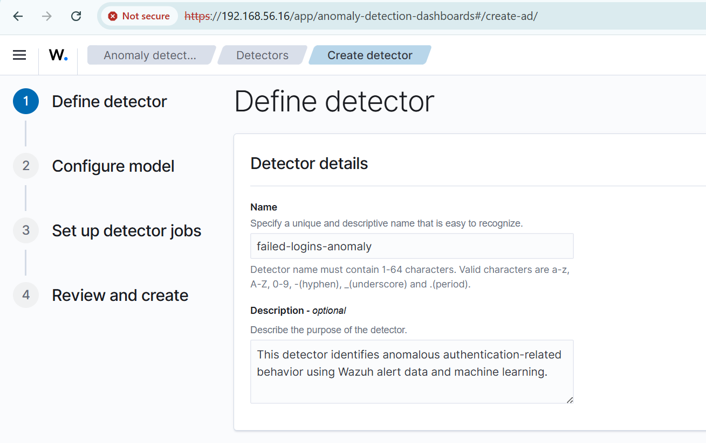
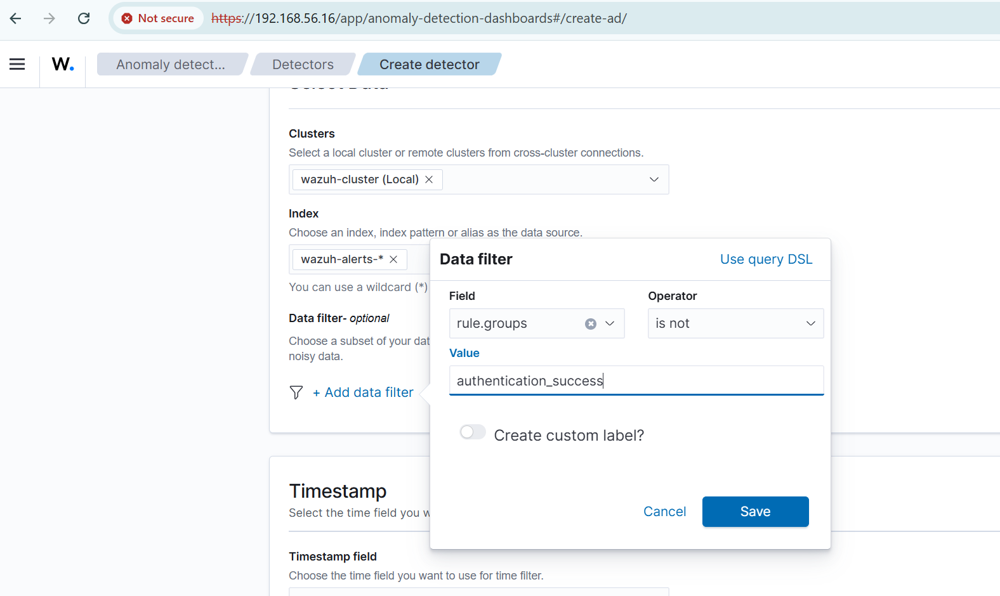

# AI-Based Anomaly Detection in Wazuh

## 📌 Project Overview

This project demonstrates the implementation of **AI-based anomaly detection** in a Wazuh Security Operations Center (SOC) environment using the **OpenSearch Anomaly Detection plugin**. The objective is to move beyond traditional rule-based detections and identify unusual authentication behavior using machine learning.

The project was completed as **Task 4** of the **WazuGuardix SOC Internship**, focusing on hands-on implementation, attack simulation, and analysis.

---

## 🧠 Objectives

* Enable anomaly detection functionality in Wazuh
* Configure a machine-learning–based anomaly detector
* Detect anomalous failed authentication behavior
* Simulate real-world attacks using Kali Linux
* Analyze anomaly scores and confidence levels
* Document findings in a SOC-ready format

---

## 🛠️ Lab Environment

| Component        | Description                  |
| ---------------- | ---------------------------- |
| Wazuh Manager    | Ubuntu Server                |
| Wazuh Agent      | Ubuntu Linux                 |
| Attacker Machine | Kali Linux                   |
| SIEM Backend     | OpenSearch                   |
| ML Engine        | OpenSearch Anomaly Detection |

---

## ⚙️ Implementation Steps

### 1️⃣ Wazuh Manager Status Verification

The Wazuh manager services were verified to ensure the SIEM environment was fully operational before configuring anomaly detection.




---

### 2️⃣ Access Anomaly Detection Dashboard

Navigate to:

```
Wazuh Dashboard → Anomaly Detection
```

The Anomaly Detection module was accessed from the Wazuh dashboard to begin configuring machine-learning–based security monitoring.


---

### 3️⃣ Create Anomaly Detector

Click **Create detector** and configure the detector with default settings.


The main anomaly detection dashboard provides visibility into detectors and includes the option to create a new anomaly detector.




---

### 4️⃣ Define Detector Configuration

* **Name:** failed-logins-anomaly
* **Data Source:** `wazuh-alerts-*`
* **Data Filter:** `rule.groups is not authentication_success`
* **Timestamp Field:** `timestamp`
* **Detector Interval:** 1 minute
* **Window Delay:** 1 minute

The main anomaly detection dashboard provides visibility into detectors and includes the option to create a new anomaly detector.


---

### 5️⃣ Detector Details Configuration

The detector was named **failed-logins-anomaly** with a description defining its purpose to identify anomalous authentication behavior.



### 6️⃣ Data Source and Filter Configuration

The data source was set to `wazuh-alerts-*` and filtered to exclude successful authentication events, focusing only on failed login attempts.



### 7️⃣ Operation Settings Configuration

The timestamp field, detector interval, and window delay were configured to enable near real-time anomaly detection.


### 5️⃣ Configure Model Features

#### 🔹 Feature 1: failed-logins-srcip

* Field: `data.srcip`
* Aggregation: `count()`
* Purpose: Detect unusual volume of failed logins from a source IP

#### 🔹 Feature 2: failed-logins-agentip

* Field: `agent.ip`
* Aggregation: `count()`
* Purpose: Detect abnormal failed login behavior targeting a specific host

📸 **Screenshot:** Feature configuration screen

---

### 6️⃣ Set Up Detector Jobs

* Enable **Real-time detection**
* Start detector automatically

📸 **Screenshot:** Detector job configuration

---

### 7️⃣ Review and Create Detector

Validate detector and model configuration, then create the detector.

📸 **Screenshot:** Detector validation and creation

---

## 🔥 Attack Simulation (Kali Linux)

To generate anomalous authentication behavior, a controlled SSH brute-force attack was launched from Kali Linux.

**Command Used:**

```bash
hydra -L user.txt -p pass.txt <UBUNTU_IP> ssh -t 4
```

**Attack Description:**

* Multiple failed SSH login attempts
* High-frequency authentication failures
* Simulates brute-force behavior commonly seen in real attacks

📸 **Screenshot:** Kali Linux Hydra brute-force attack

---

## 📊 Detection Results & Analysis

### 🔎 Real-Time Anomaly Results

* **Anomaly Grade:** 1.00 (High severity)
* **Confidence:** ~0.18 (Early-stage ML model confidence)
* **Last Occurrence:** Timestamp shown in dashboard

📸 **Screenshot:** Live anomaly detection results

---

### 📈 Feature Breakdown Analysis

#### failed-logins-srcip

* Shows spikes in failed login attempts from a single source IP
* Red markers indicate anomaly detection beyond expected behavior

📸 **Screenshot:** Feature breakdown – srcip

#### failed-logins-agentip

* Highlights abnormal authentication targeting a specific agent
* Confirms attack impact on the Ubuntu host

📸 **Screenshot:** Feature breakdown – agentip

---

## 🧩 Why This Anomaly Is Security-Relevant

* Indicates brute-force or credential-stuffing attacks
* Identifies threats not caught by static thresholds
* Enhances SOC visibility into abnormal authentication behavior

---

## 🎯 Key Learnings

* AI-based detection complements rule-based SIEM alerts
* Anomaly grade represents severity; confidence improves with more data
* Machine learning enables early detection of unknown attack patterns
* Proper attack simulation is critical for SOC validation

---

## 🏁 Conclusion

This project successfully demonstrates how **machine-learning–driven anomaly detection** enhances SOC monitoring capabilities in Wazuh. By simulating real-world attacks and analyzing anomaly behavior, the task highlights the value of AI in detecting subtle and evolving security threats beyond traditional rules.

---

## 📚 References

* Wazuh Official Blog: Enhancing IT Security with Anomaly Detection

---

## 👤 Author

**Ishtiaq Rashid**
SOC Intern | Cybersecurity Analyst
